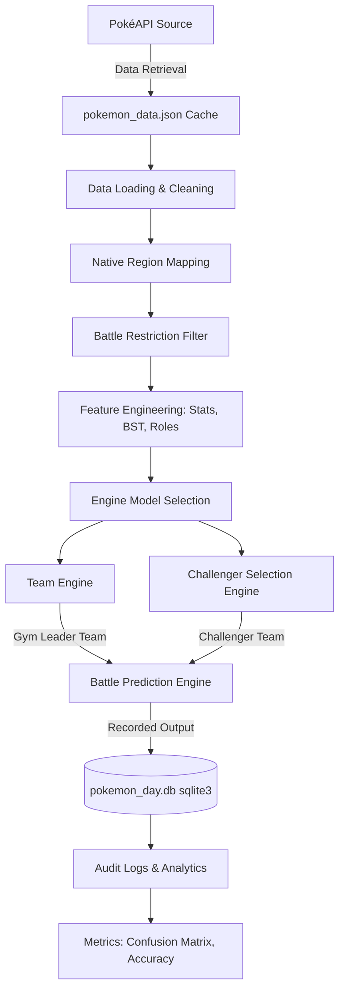

# Pokémon Day II — 3ISA Engine System Documentation

**Section:** 3ISA  
**Developers:** [Enter Developer Names Here]  
**Class President Verification:** [President Name]  
**Submission Date:** June 3, 2026  

---

## 1. System Overview & Purpose
This system is developed to support the battles on **Pokémon Day II** (scheduled for June 2, 9:00 AM) for section **3ISA**. The system provides data-driven decision support for:
1. **Team Engine:** Generating native-region Gym Leader defending teams following type specializations.
2. **Challenger Selection Engine:** Generating counter-lineups from allowed regional pools to defeat opponent Gym Leaders.
3. **Battle Prediction Engine:** Predicting match winners before battles start, recording live battle outcomes (ground truth), and calculating performance metrics (accuracy, confusion matrix).

---

## 2. Allowed Regions
As assigned to section **3ISA**, the engines strictly utilize and filter Pokémon native to:
*   **Hoenn** (Generation 3)
*   **Sinnoh** (Generation 4)
*   **Galar** (Generation 8)

---

## 3. Data Pipeline & Architecture
The system retrieves data from the **PokéAPI** (cached locally in `pokemon_data.json` for reliable offline use during Pokémon Day).

### Data Pipeline Diagram


---

## 4. Data Processing & Feature Engineering

### Data Retrieval & Cleaning
*   **Source:** PokéAPI (https://pokeapi.co)
*   **Local Caching:** 293 Pokémon from Hoenn, Sinnoh, and Galar are pre-fetched and saved to `pokemon_data.json` to ensure 100% uptime and offline availability.
*   **Data Cleaning:** Empty secondary types (`type_2`) are filled with empty strings. Stats (HP, Attack, Defense, Special Attack, Special Defense, Speed) are parsed into numeric formats.

### Native Region Mapping
Each Pokémon is mapped to its original/native generation:
*   **Hoenn:** Original Generation 3 (IDs 252 - 386)
*   **Sinnoh:** Original Generation 4 (IDs 387 - 493)
*   **Galar:** Original Generation 8 (IDs 810 - 898)
*   *Verification Rule:* Non-native Pokémon (e.g., Pikachu, originally from Kanto) are strictly filtered out of 3ISA selections.

### Battle Restriction Filtering
The system strictly enforces the following battle restrictions:
*   **Legendary / Mythical / Paradox Pokémon** are marked as `is_restricted: true` (or completely omitted from the pool) and filtered out prior to execution.
*   **Restricted Mechanics:** The team generator produces basic base-form or standard evolved Pokémon and exports them in plain formats, ensuring no Megas, Z-Moves, Gigantamax, or Terastallization are recommended.

### Feature Engineering
*   **Base Stat Total (BST):** Summarized as `total` (sum of HP, Attack, Defense, Special Attack, Special Defense, Speed).
*   **Role Classification:** Categorized based on stat strengths:
    *   **Sweeper:** Speed $\ge 90$
    *   **Tank:** HP $\ge 90$ and Defense $\ge 90$
    *   **Special Attacker:** Special Attack $\ge 100$
    *   **Physical Attacker:** Attack $\ge 100$
    *   **Support:** Special Defense $\ge 90$
    *   **Balanced:** Default fallback role.

---

## 5. Engines & Models Explanation

### System 1: Team Engine
Generates a 6-Pokémon Gym Leader team.
*   **Logic / Models:**
    *   *Rule-Based Only:* Ranks native Pokémon by BST and type match.
    *   *KNN + Rule-Based Scoring:* Trains a `KNeighborsClassifier` on the overall dataset to predict Pokémon roles, ensuring a balanced role distribution (maximum 2 of the same role per team).
    *   *Random Forest Scoring:* Trains a `RandomForestClassifier` to evaluate Pokémon viability (total stats $\ge 450$), ranking the pool based on competitive class probability combined with type specialization matching.

### System 2: Challenger Selection Engine
Recommends a 6-Pokémon counter-team.
*   **Logic / Models:**
    *   *Type Advantage Scoring:* Selects challengers based purely on offensive type advantage (2x or 1x effectiveness against Gym Leader's types).
    *   *Stat-Based Ranking:* Scores challengers based on how much their stats exceed the Gym Leader's average stats.
    *   *Counter Scoring + KNN:* Combines type advantages (10 pts per super-effective matchup), stat advantages (5 pts for high attack/speed/special attack), and KNN role balancing.

### System 3: Battle Prediction Engine
Predicts the winner and confidence score of a matchup.
*   **Logic / Model:**
    *   *Rule-Based Predictor:* Aggregates the average BST, speed, and defense of both teams, calculates reciprocal type coverage scores (average effectiveness of Attacker vs Defender), and computes probability percentages.
    *   *Confidence Rating:* Expressed as a probability percentage (max 95%).
    *   *Prediction Logging:* Predictions must be recorded under a unique `Match ID` *before* the battle begins.

---

## 6. Database Schema & Logging
The system utilizes a local SQLite database (`pokemon_day.db`) containing five primary tables:

1.  `team_outputs` — Saves generated gym leader lineups.
2.  `challenger_outputs` — Saves recommended challenger counter lineups.
3.  `predictions` — Logs pre-battle predictions.
4.  `ground_truth` — Logs actual battle outcomes, turns, and Showdown replay URLs.
5.  `audit_log` — Tracks every action taken by the operator with timestamps to prevent tampering.

---

## 7. How to Run the System
1.  Ensure you have **Python 3.12+** installed.
2.  Install dependencies:
    ```bash
    pip install -r requirements.txt
    ```
3.  Launch the application:
    ```bash
    streamlit run app.py
    ```
4.  Open the local URL in your web browser: **http://localhost:8501**

---

## 8. Limitations & Future Work
*   **Live PokéAPI Sync:** Currently relies on a local JSON file to guarantee reliability during Pokémon Day, but can be configured to fetch live updates.
*   **Advanced ML Models:** Future iterations could train prediction classifiers on a larger historical Pokémon Showdown battle database rather than using heuristic scoring.
